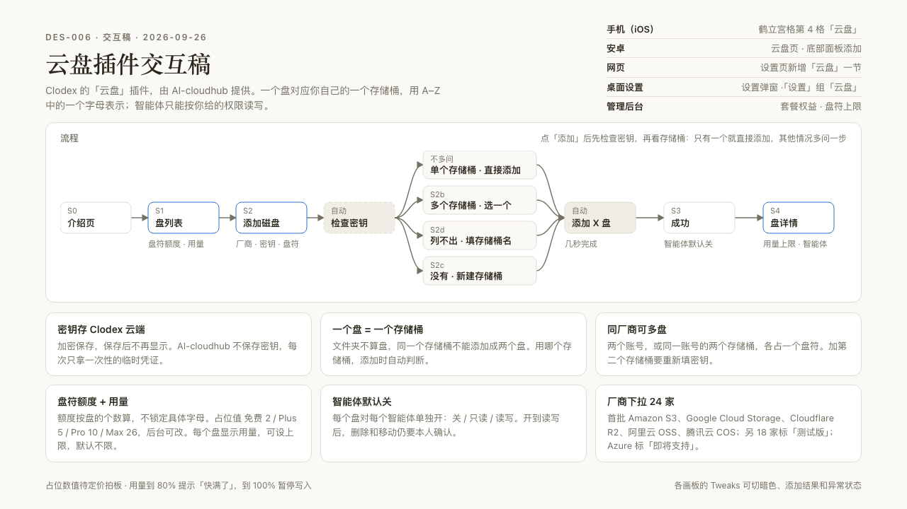
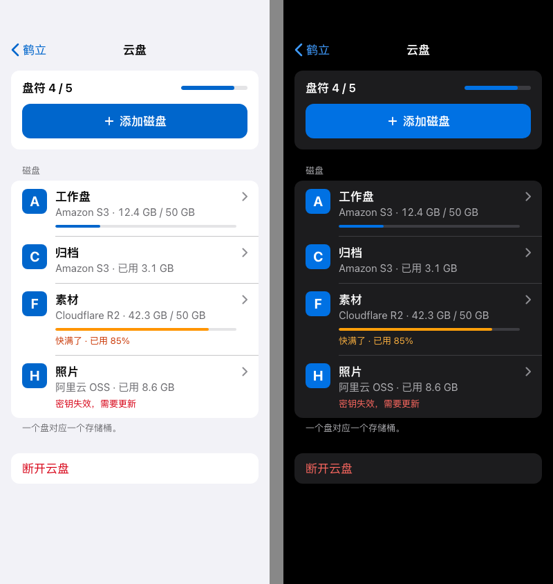
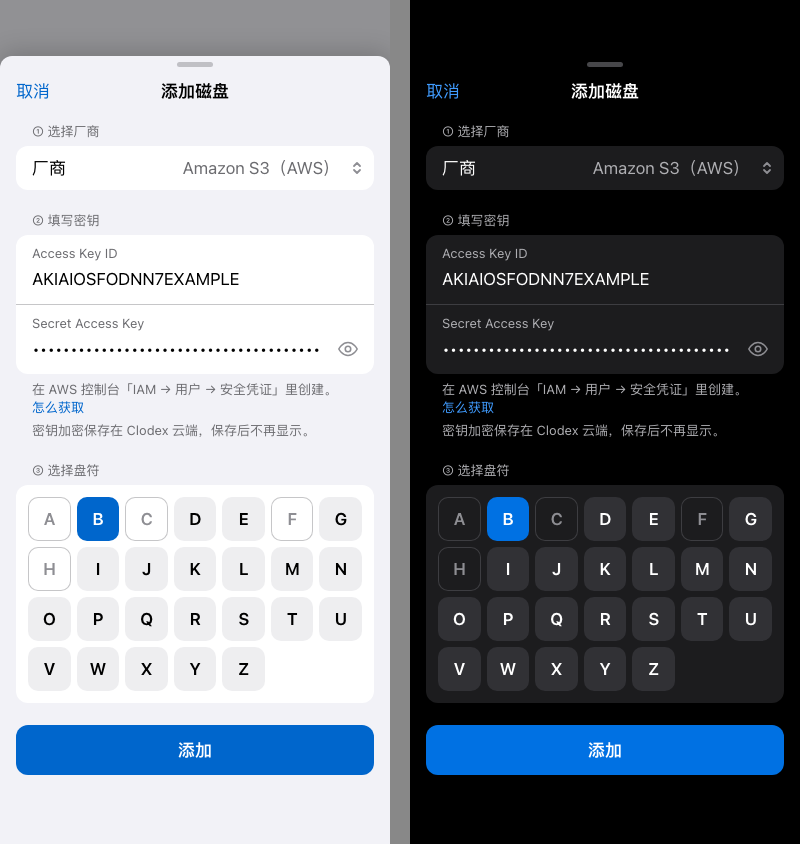
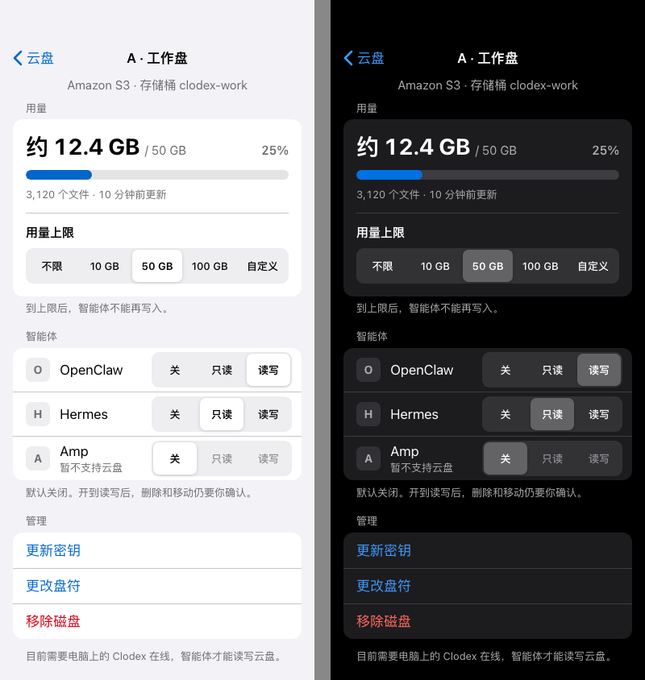
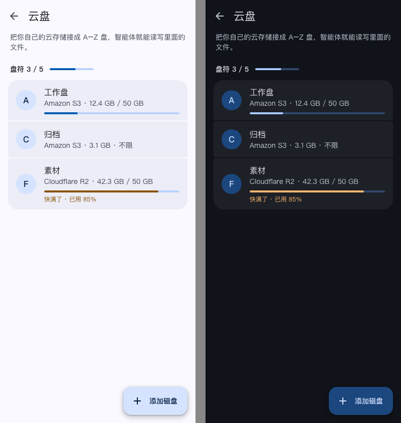
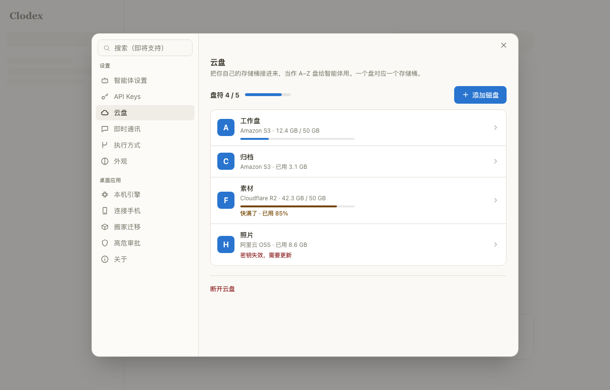
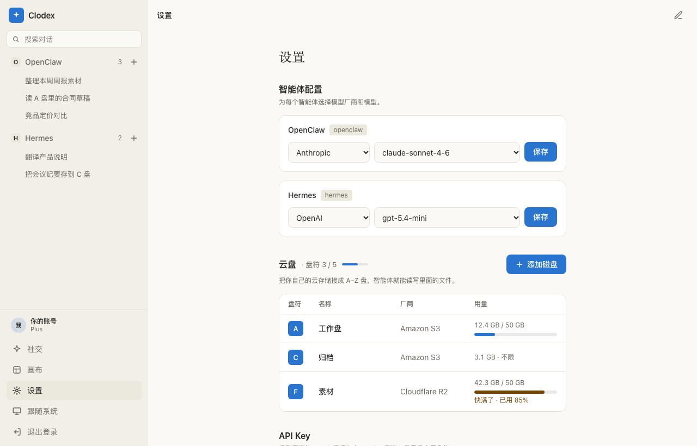

# AI-cloudhub

**人和 Agent 的多云磁盘操作系统。** 用你自己的对象存储（Cloudflare R2、AWS S3、阿里云 OSS、腾讯云 COS、Backblaze B2、MinIO……）当「盘」，把它们变成 Agent 工作台里的 A 盘、B 盘。Go 100% 自研，单二进制，MIT 协议。

> **AI-cloudhub** turns the object-storage buckets you already own (R2, S3, OSS, COS, B2, MinIO, Qiniu, Oracle…) into lettered drives that humans and AI agents can read and write as if they were local. Bring your own storage, bring your own compute; the control plane never touches your file bytes. Written in Go, ships as a single binary, MIT licensed.

[](https://github.com/awmbtc/AI-cloudhub/releases)
[](go.mod)
[](LICENSE)
[](docs/openapi.yaml)

```text
用户 API Key → Provider（厂商凭证）→ Drive（逻辑盘，盘符 A–Z）
      → hubd（本机挂载）/ runner（BYOC 云端执行）/ MCP（Agent 工具）
      → 短时会话 + Manifest → rclone mount / 写缓存
      → 用户自己的 R2 / S3 / OSS / COS / B2 / MinIO / Kodo / OCI …
```

---

## 目录

- [它解决什么问题](#它解决什么问题)
- [三条红线](#三条红线)
- [核心概念](#核心概念)
- [架构](#架构)
- [功能一览](#功能一览)
- [支持的存储厂商](#支持的存储厂商)
- [快速开始](#快速开始)
- [给 Agent 用：MCP 工具](#给-agent-用mcp-工具)
- [HTTP API](#http-api)
- [与 Clodex 的集成（进行中）](#与-clodex-的集成进行中)
- [安全模型](#安全模型)
- [部署与运维](#部署与运维)
- [文档索引](#文档索引)
- [路线图](#路线图)
- [赞助商](#赞助商)
- [参与贡献](#参与贡献)
- [许可证](#许可证)

---

## 它解决什么问题

AI Agent 越来越能干活，但它们产出的文件要放哪？

- 放 Agent 平台的云端，你的数据就寄人篱下，迁移麻烦，账单也不透明。
- 放自己的对象存储，Agent 又不会用：每家厂商的 SDK、签名、region、endpoint 都不一样。

AI-cloudhub 在中间加一层很薄的控制面：

1. 你把厂商的 Access Key 登记进来（加密保存），把某个桶定义成 **A 盘**。
2. Agent 只认识「A 盘」，不必知道它背后是 R2 还是 COS。
3. 文件字节**直接**在执行 Agent 的机器和你的桶之间传输，控制面只签发短时凭证和路径规则，从不中转文件内容。

所以它**不是网盘**，也不是 MinIO 的魔改版。它更像一张「盘符表」加一套挂载和授权机制。

## 三条红线

这三条写在 [`docs/DECISIONS.md`](docs/DECISIONS.md) 里，所有功能都不得违背：

| 红线 | 含义 |
|---|---|
| **BYOS（自带存储）** | 文件永远进用户自己的桶。控制面不代存对象、不中转 body。 |
| **BYOC（自带算力）** | Agent 跑在用户自己的电脑或云主机上。我们**不**运营大规模 Runner 池替所有人跑 Agent。 |
| **人的身份 ≠ Agent 的身份** | Agent 拿的是带 scope 和盘白名单的 Agent Token，永远不是用户的登录凭证。 |

## 核心概念

| 概念 | 说明 |
|---|---|
| **Provider** | 一家厂商的凭证（AK/SK、endpoint、region）。SecretKey 用 `AI_CLOUDHUB_MASTER_KEY` 加密后入库。 |
| **Drive** | 逻辑盘 = Provider + 一个桶（+ 可选前缀），带一个盘符别名（如 `A`）和挂载点。 |
| **Binding** | 某台设备上「希望把某个盘挂到某个路径」的声明，有期望状态和实际状态。 |
| **Session / Manifest** | 一次短时会话：签发凭证、生成 rclone 配置和一份 JSON Manifest（工作区路径、环境变量、读写规则），交给运行时。 |
| **hubd** | 装在用户本机的守护进程。轮询 Binding，用 rclone 把盘挂成本地目录，或者按需同步一个工作区。 |
| **runner** | 跑在用户自己机器上的任务执行器（BYOC）。领取任务、挂盘、执行命令、上报结果。 |
| **MCP helper** | 给 Agent 宿主（Cursor、Claude Code 等）用的 stdio 工具服务：列盘、解析盘符、清单、快照、任务。 |
| **Agent** | 一个受限身份：scopes、允许访问的盘、读写路径前缀，可随时禁用或吊销。 |

## 架构

```text
┌──────────────── 你的电脑 / 你的云主机 ────────────────┐
│  Agent 宿主（Cursor / Claude Code / Clodex …）         │
│     │ stdio MCP / HTTP                                │
│     ▼                                                 │
│  hubd ──── rclone mount ────► /workspace/A  ◄── 文件字节│
│  runner ── 领任务 → 挂盘 → 执行 → 上报                  │
└──────────┬───────────────────────────────┬────────────┘
           │ 控制面 API（只走元数据和凭证）     │ 直连桶（S3 协议）
           ▼                               ▼
┌──── AI-cloudhub 控制面（单二进制）────┐   ┌── 你的桶 ──┐
│ 用户 / Agent 身份 · Provider · Drive │   │ R2 / S3   │
│ Binding · Session · Manifest        │   │ OSS / COS │
│ 快照 · 策略 · 审计 · 指标            │   │ B2 / MinIO│
│ SQLite（默认）或 PostgreSQL          │   └───────────┘
└─────────────────────────────────────┘
```

- 控制面很轻：一台 2 核 4G 的轻量服务器就能跑，SQLite 起步，多副本换 PostgreSQL + Redis。
- 数据面完全在用户侧：rclone 做挂载和缓存，S3 协议直连各家厂商。

## 功能一览

**存储与挂载**
- 8 家厂商统一成 S3 协议接入，逐家做过联调（见 [`docs/VENDORS.md`](docs/VENDORS.md)、[`docs/CLOUD-INTEGRATION.md`](docs/CLOUD-INTEGRATION.md)）。
- 两种挂载模式：`mount`（rclone FUSE，实时读写，带写缓存）和 `sync_workspace`（不需要 FUSE，拉取一个工作区、结束时推回）。
- 可选的原生短时凭证：阿里云 RAM STS、腾讯云 CAM STS、AWS / MinIO AssumeRole、七牛下载凭证、OCI 预签名。按厂商用环境变量开启，失败自动回退。
- 元数据快照与版本恢复：`snapshots`、`restore-plan`、`restore-version`，给 Agent 一个「撤销」的机会。
- 预签名下载：不经控制面直接取对象。

**身份与授权**
- 用户名密码注册登录，首个用户即管理员；可关闭开放注册。
- Agent 身份：按 scope（`drive.read` / `drive.write` / `job.run` / `provider.*`）和盘白名单授权，禁用即刻失效。
- 策略引擎：JSON 策略文件，或接 OPA Rego（[`docs/POLICY.md`](docs/POLICY.md)）。
- 审计日志、用户与角色管理的 admin API。

**任务与执行（BYOC）**
- 持久化任务队列：领取、租约、心跳、重试、幂等键、Webhook 出站（[`docs/JOBS.md`](docs/JOBS.md)）。
- runner 沙箱：路径围栏、环境变量白名单、Linux seccomp（[`docs/SECCOMP.md`](docs/SECCOMP.md)）。
- 连接器：git 浅克隆、PostgreSQL、MySQL 在 runner 侧物化（[`docs/CONNECTORS.md`](docs/CONNECTORS.md)）。

**给 Agent 用**
- MCP stdio 工具服务，30+ 个工具；Cursor 一键接入脚本（[`docs/CURSOR-MCP.md`](docs/CURSOR-MCP.md)）。
- 浏览器连接向导 `/wizard`：注册 → 登记厂商 → 建盘 → 签发 Agent Token → 复制 `mcp.json`。
- 盘符别名：`GET /v1/drives/by-alias/A`，Agent 说「放到 A 盘」就能落到对应的桶。

**运维**
- Prometheus `/metrics`、`/healthz`、`/readyz`，示例 Grafana 面板（[`deploy/grafana/`](deploy/grafana/)）。
- Docker Compose 生产栈、nginx / Caddy 反代示例、Windows 依赖一键安装脚本。

## 支持的存储厂商

| 批次 | 厂商 | 备注 |
|---|---|---|
| A | Amazon S3 · Cloudflare R2 · MinIO | S3 原生 |
| B | Backblaze B2 · 阿里云 OSS · 腾讯云 COS | 已联调；OSS / COS 支持原生 STS |
| C | 七牛云 Kodo · Oracle OCI | 七牛下载凭证、OCI IAM / 预签名 |

其他 S3 兼容服务（Wasabi、DigitalOcean Spaces、华为云 OBS、火山引擎 TOS 等）按 `s3` 类型加自定义 endpoint 即可尝试；正式列入需要真账号联调。各家密钥怎么填见 [`docs/PROVIDERS.md`](docs/PROVIDERS.md)。

## 快速开始

### 1. 编译

```bash
git clone https://github.com/awmbtc/AI-cloudhub.git
cd AI-cloudhub
export CGO_ENABLED=0
go build -o .bin/api    ./cmd/api
go build -o .bin/hubd   ./cmd/hubd
go build -o .bin/runner ./cmd/runner
go build -o .bin/mcp    ./cmd/mcp
```

也可以直接从 [Releases](https://github.com/awmbtc/AI-cloudhub/releases) 下载多平台二进制。

### 2. 启动控制面

```bash
export JWT_SECRET="$(openssl rand -base64 32)"             # 会话签名
export AI_CLOUDHUB_MASTER_KEY="$(openssl rand -base64 32)"   # 加密厂商密钥
./.bin/api
```

默认监听 `:8080`，数据存 `./data/ai-cloudhub.db`（SQLite）。打开 <http://127.0.0.1:8080/wizard>，按向导注册、登记厂商密钥、建盘、签发 Agent Token。

生产环境：设 `AI_CLOUDHUB_DB=postgres://…`、`AI_CLOUDHUB_REDIS=redis://…`、`AI_CLOUDHUB_STRICT=1`、`AI_CLOUDHUB_ALLOW_REGISTER=0`，详见 [`docs/PRODUCTION.md`](docs/PRODUCTION.md)。

### 3. 把盘挂到本机

```bash
AI_CLOUDHUB_API=http://127.0.0.1:8080 \
AI_CLOUDHUB_TOKEN=<你的 token> \
AI_CLOUDHUB_DEVICE_ID=laptop-1 \
./.bin/hubd
```

hubd 需要 rclone；`mount` 模式还需要 macFUSE（macOS）或 WinFsp（Windows）。没有 FUSE 时用 `sync_workspace` 模式。详见 [`docs/HUBD.md`](docs/HUBD.md)、[`docs/WINDOWS.md`](docs/WINDOWS.md)。

### 4. 让 Agent 用起来

```bash
AI_CLOUDHUB_API=http://127.0.0.1:8080 AI_CLOUDHUB_TOKEN=<Agent Token> ./.bin/mcp
```

或者一条命令给 Cursor 装好：

```bash
./scripts/cursor-mcp-install.sh
```

### 5. 跑一遍主线验收

```bash
./scripts/smoke-p0.sh   # 注册 → 厂商 → 盘 → 会话 → Manifest
make smoke-golden       # 黄金路径（见 docs/GOLDEN-PATH.md）
```

## 给 Agent 用：MCP 工具

`cmd/mcp` 是一个 stdio JSON-RPC 服务，实现 `initialize` / `tools/list` / `tools/call`，Agent 宿主按 MCP 方式拉起即可。工具按 Agent Token 的 scope 做门禁。

| 工具 | Scope | 作用 |
|---|---|---|
| `whoami` · `list_drives` · `resolve_drive` | drive.read | 我是谁；有哪些盘；「A 盘」是哪个盘 |
| `list_objects` · `object_presign_get` | drive.read | 对象清单；预签名下载链接 |
| `list_snapshots` · `create_snapshot` · `object_restore_version` | drive.read / write | 快照；恢复某个历史版本 |
| `list_bindings` · `ensure_mounted_hint` · `workspace_env` · `resolve_path` | drive.read / 本地 | 挂载状态；工作区路径围栏 |
| `list_jobs` · `create_job` · `claim_next_job` · `complete_job` · `cancel_job` | job.run | BYOC 任务队列（由用户自己的 runner 执行） |

完整清单与示例见 [`docs/MCP.md`](docs/MCP.md)、[`docs/QUICKSTART-AGENT.md`](docs/QUICKSTART-AGENT.md)。

## HTTP API

完整契约在 [`docs/openapi.yaml`](docs/openapi.yaml)。常用端点：

| 方法 | 路径 | 说明 |
|---|---|---|
| `POST` | `/v1/auth/register` · `/v1/auth/login` · `/v1/auth/refresh` | 账号 |
| `GET` | `/v1/me` | 当前身份（人或 Agent）与 scope |
| `CRUD` | `/v1/providers` | 厂商凭证；`/{id}/health` 探活 |
| `CRUD` | `/v1/drives` | 逻辑盘；`GET /v1/drives/by-alias/{alias}` 按盘符取盘 |
| `POST` | `/v1/drives/{id}/session` | 签发会话 + Manifest |
| `GET/POST` | `/v1/drives/{id}/objects` · `…/presign-get` · `…/restore-version` | 清单、预签名、版本恢复 |
| `GET/POST` | `/v1/drives/{id}/snapshots` · `…/diff` · `…/{sid}/restore` | 元数据快照 |
| `CRUD` | `/v1/bindings` | 设备挂载声明；`/{id}/session`、`/{id}/report`、`/{id}/desired` |
| `CRUD` | `/v1/agents` · `POST /v1/agents/{id}/token` | Agent 身份与 Token |
| `GET/POST` | `/v1/jobs` · `/v1/jobs/next/claim` · `/{id}/complete` | BYOC 任务 |
| `GET` | `/v1/admin/users` · `/v1/admin/audit` · `/v1/admin/policy` | 管理（admin） |
| `GET` | `/healthz` · `/readyz` · `/metrics` | 健康与指标 |

## 与 Clodex 的集成（进行中）

[Clodex](https://clodex.lol) 是一个多引擎 AI Agent 平台（OpenClaw、Hermes、Pi、Amp 等引擎，云端推理 + 本机执行）。AI-cloudhub 正在作为 Clodex 的**云盘插件**接入，目标体验是：

1. 用户在 Clodex 里点「添加磁盘」：选厂商 → 填密钥 → 选一个盘符（A–Z）。一个盘对应一个存储桶，同一厂商可以加多个盘。
2. 之后不管 Agent 的工作台在云端还是在用户电脑上，它都认为 **A:/ 就在自己手边**。用户说「把周报放到 A 盘」，Agent 写 `A:/周报/2026-W39.md`，对象实际落进用户自己的 R2。
3. 每个盘可以逐个开放给某个 Agent（默认关闭），能看到空间用量，也能设用量上限；删除、移动、覆盖这类操作要用户本人审批。

实现上不做 FUSE 挂载，而是在 Agent 的工具层做一个「虚拟盘」：文件工具识别到 `A:/` 路径就改走对象接口，文件内容用单次有效的预签名链接在执行端和桶之间直传，AI-cloudhub 只做存储引擎，每次操作从 Clodex 拿一次性凭证租约。

下面是这个插件的交互稿（设计预览，不是最终界面）：

<p align="center">
  
</p>

<table>
  <tr>
    <td align="center"><br><sub>手机端：盘列表、盘符额度与用量</sub></td>
    <td align="center"><br><sub>手机端：添加磁盘（厂商 → 密钥 → 盘符）</sub></td>
  </tr>
  <tr>
    <td align="center"><br><sub>手机端：盘详情、用量上限、按智能体开关</sub></td>
    <td align="center"><br><sub>安卓端：盘列表</sub></td>
  </tr>
  <tr>
    <td align="center" colspan="2"><br><sub>桌面端：设置 › 云盘</sub></td>
  </tr>
  <tr>
    <td align="center" colspan="2"><br><sub>网页端：设置页里的云盘区块</sub></td>
  </tr>
</table>

这条线上 AI-cloudhub 侧要做的事（宿主数据面 API、按次凭证租约、更多厂商联调、盘用量统计）会在 [`docs/ROADMAP-2.0.md`](docs/ROADMAP-2.0.md) 和 Releases 里逐步公开。

## 安全模型

- **密钥加密存储**：厂商 SecretKey 用主密钥加密后入库。生产请配置 `AI_CLOUDHUB_MASTER_KEY` 并开启 `AI_CLOUDHUB_STRICT=1`：严格模式下缺主密钥会拒绝启动，不会明文落库。
- **最小权限**：建议每个盘用只授权单个桶的厂商密钥；Agent Token 再按 scope 和盘白名单收窄；任何禁用或收权立即生效。
- **短时凭证**：开启厂商原生 STS 后，运行时拿到的是短时凭证；`session` 本身有效期短，过期需刷新。
- **执行沙箱**：runner 只允许工作区内的路径，环境变量白名单，Linux 上可加 seccomp。
- **不中转数据**：控制面从不读写对象 body；API 响应不回显 SecretKey。
- **人机分离**：admin、设备、Agent 管理等接口只接受人的会话，Agent Token 一律拒绝。

已知限制见 [`docs/KNOWN_LIMITATIONS.md`](docs/KNOWN_LIMITATIONS.md)。

**报告安全问题**：请通过 GitHub 的 [私密漏洞报告](https://github.com/awmbtc/AI-cloudhub/security/advisories/new)（Security → Report a vulnerability）联系，不要开公开 issue。

## 部署与运维

| 场景 | 做法 |
|---|---|
| 最省钱 | 一台 2 核 4G 轻量服务器 + SQLite，年费一两百元（[`docs/BUDGET-WOOL.md`](docs/BUDGET-WOOL.md)） |
| 生产 | `docker compose -f deploy/docker-compose.prod.yml up -d`（api + PostgreSQL + Redis），前面挂 nginx 或 Caddy 做 TLS（[`docs/PRODUCTION.md`](docs/PRODUCTION.md)、[`docs/CUTOVER.md`](docs/CUTOVER.md)） |
| 监控 | `/metrics` 接 Prometheus，导入 `deploy/grafana/` 的面板（[`docs/METRICS.md`](docs/METRICS.md)） |
| 发版 | `git tag vX.Y.Z && git push --tags` 触发多架构二进制构建；本地 `make release-binaries` |

## 文档索引

| 文档 | 内容 |
|---|---|
| [ARCHITECTURE.md](docs/ARCHITECTURE.md) | 架构定稿 |
| [DECISIONS.md](docs/DECISIONS.md) | 决策记录（D-001 不做 Runner 池、D-003 主线收口） |
| [GOLDEN-PATH.md](docs/GOLDEN-PATH.md) | 黄金路径演示剧本 + `make smoke-golden` |
| [RUNTIME.md](docs/RUNTIME.md) · [HUBD.md](docs/HUBD.md) · [RUNNER.md](docs/RUNNER.md) | 运行时总览、本机守护进程、BYOC 执行器 |
| [PROVIDERS.md](docs/PROVIDERS.md) · [VENDORS.md](docs/VENDORS.md) · [CLOUD-INTEGRATION.md](docs/CLOUD-INTEGRATION.md) | 各厂商密钥怎么填、批次、多云接入手册 |
| [STS.md](docs/STS.md) · [STS-RUNBOOK.md](docs/STS-RUNBOOK.md) | 原生短时凭证与联调 |
| [MCP.md](docs/MCP.md) · [CURSOR-MCP.md](docs/CURSOR-MCP.md) · [QUICKSTART-AGENT.md](docs/QUICKSTART-AGENT.md) | Agent 接入 |
| [PLUGIN-FOR-AGENTS.md](docs/PLUGIN-FOR-AGENTS.md) · [PLUGIN-OAUTH.md](docs/PLUGIN-OAUTH.md) | 作为其他 Agent 软件的插件；宿主 OAuth 设计 |
| [POLICY.md](docs/POLICY.md) · [SECCOMP.md](docs/SECCOMP.md) | 策略引擎、沙箱 |
| [JOBS.md](docs/JOBS.md) · [CONNECTORS.md](docs/CONNECTORS.md) | 任务队列、连接器 |
| [PRODUCTION.md](docs/PRODUCTION.md) · [CUTOVER.md](docs/CUTOVER.md) · [METRICS.md](docs/METRICS.md) · [BUDGET-WOOL.md](docs/BUDGET-WOOL.md) · [RISK-COST.md](docs/RISK-COST.md) | 生产、上线、监控、成本 |
| [WINDOWS.md](docs/WINDOWS.md) | Windows 安装 WinFsp / rclone |
| [MEMORY.md](docs/MEMORY.md) · [MARKETPLACE.md](docs/MARKETPLACE.md) · [MODULES.md](docs/MODULES.md) · [STAGE-C.md](docs/STAGE-C.md) | Stage C 实验模块 |
| [PROGRESS.md](docs/PROGRESS.md) · [KNOWN_LIMITATIONS.md](docs/KNOWN_LIMITATIONS.md) · [ROADMAP-2.0.md](docs/ROADMAP-2.0.md) | 进度、限制、路线图 |
| [openapi.yaml](docs/openapi.yaml) | HTTP API 契约 |

## 路线图

- **已完成**：P0–P3 主线（STS、Manifest、Binding、hubd、runner、任务队列、MCP、指标），厂商 A/B/C 三批，快照与版本恢复，浏览器向导，Cursor 一键接入。
- **进行中**：作为 Clodex 云盘插件的宿主数据面（面向宿主平台的列目录 / 预签名上传下载 / 删除 / 复制接口，按次凭证租约，盘用量统计）；扩展更多 S3 兼容厂商（Google Cloud Storage、Wasabi、华为云 OBS、火山引擎 TOS 等）的真账号联调。
- **规划中**：宿主 OAuth（设备码 / PKCE）、Azure Blob 适配器、更细的路径级授权、多副本会话存储。

## 赞助商

AI-cloudhub 由以下产品支持开发。它们也是这套「自带存储」思路的第一批使用者。

<table>
  <tr>
    <td width="33%" align="center" valign="top">
      <a href="https://clodex.lol"></a>
      <br><br>
      <b><a href="https://clodex.lol">Clodex</a></b>
      <br><sub>激活并使用你的 AI 智能体</sub>
      <br><br>
      <p align="left">多引擎 AI Agent 平台：OpenClaw、Hermes、Pi、Amp 等引擎在云端推理，执行在你自己的电脑上；自带 LLM Key，云端不做模型转发。网页、桌面、iOS、安卓四端同步。AI-cloudhub 正在作为它的「云盘」插件接入。</p>
      <a href="https://clodex.lol"><b>打开 Clodex →</b></a>
    </td>
    <td width="33%" align="center" valign="top">
      <a href="https://pub-4d17b4d5177b400b8345264a529e741d.r2.dev/clodex/android/preview/0.1.0-21/Clodex-android-21-debug.apk"></a>
      <br><br>
      <b>Clodex 安卓 App</b>
      <br><sub>预览版 · 直接安装 APK</sub>
      <br><br>
      <p align="left">原生 Kotlin + Material 3 的安卓客户端：领养智能体、对话、频道、账号与钱包，支持 App 内更新。当前为预览版（0.1.0 · build 21），未上架应用商店，安装时需允许「未知来源」。</p>
      <a href="https://pub-4d17b4d5177b400b8345264a529e741d.r2.dev/clodex/android/preview/0.1.0-21/Clodex-android-21-debug.apk"><b>下载 APK →</b></a>
      <br><sub><a href="https://pub-4d17b4d5177b400b8345264a529e741d.r2.dev/clodex/android/preview/latest.json">最新版本清单（latest.json）</a></sub>
    </td>
    <td width="33%" align="center" valign="top">
      <a href="https://heli.clodex.lol"></a>
      <br><br>
      <b><a href="https://heli.clodex.lol">HeliSMS</a></b>
      <br><sub>在线短信接收平台</sub>
      <br><br>
      <p align="left">按服务和国家选择临时号码，在线接收短信验证码，并提供 API。使用 Clodex 统一账号和钱包管理号码、订单与退款；支持 USDT 等多种充值方式。</p>
      <a href="https://heli.clodex.lol"><b>打开 HeliSMS →</b></a>
    </td>
  </tr>
</table>

想赞助这个项目，或者把你的产品放到这里？开一个 issue 说明即可。

## 参与贡献

- 提 issue 前先看 [`docs/KNOWN_LIMITATIONS.md`](docs/KNOWN_LIMITATIONS.md) 和 [`docs/DECISIONS.md`](docs/DECISIONS.md)：三条红线之内的改动都欢迎，红线之外的（比如平台 Runner 池、代存对象）不会合并。
- 本地跑测试：`CGO_ENABLED=0 go test ./...`；现场回归：`make smoke-agent`、`make smoke-job`、`make smoke-mcp`、`make smoke-policy`。
- 新增厂商：按 `internal/provider/types.go` 加类型，补 `docs/PROVIDERS.md` 的填写说明，并附真账号联调记录。
- 提交前请勿把任何密钥、`.env` 或 rclone 配置写进仓库。

## 许可证

[MIT](LICENSE) © 2026 awmbtc。

本项目不发行 MinIO 的修改版本；MinIO、rclone 及各云厂商服务遵循各自的许可条款。
